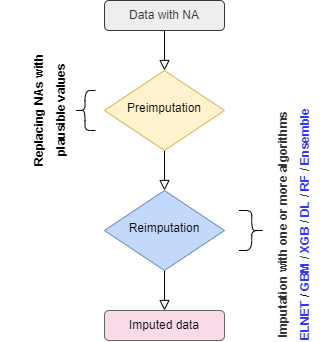
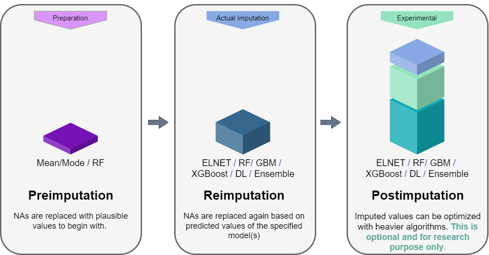
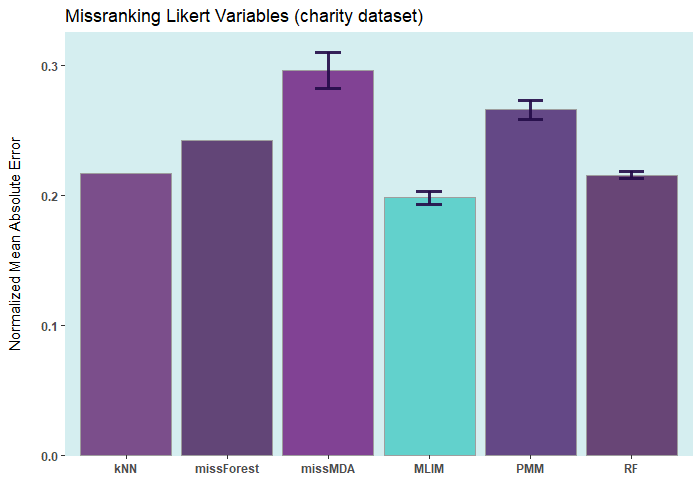

<a href="https://github.com/haghish/mlim"></a>

**`mlim`** : Multiple Imputation with Automated Machine Learning
================================================================

<!--<a href="https://github.com/haghish/mlim"></a> -->
[](https://github.com/haghish/mlim/releases/?include_prereleases&sort=semver "View GitHub releases")
[](https://cran.r-project.org/package=mlim)  [](https://cran.r-project.org/package=mlim) [](https://CRAN.R-project.org/package=mlim)
<!--  [](https://github.com/haghish/mlim_handbook/blob/main/mlim_handbook.pdf) 

[](https://cran.r-project.org/package=mlim) https://shields.io/ 

[](https://github.com/haghish/mlim/releases/?include_prereleases&sort=semver "View GitHub releases")
 -->


**`mlim`** is the first missing data imputation software to implement automated machine learning for performing _multiple imputation_ or _single imputation_ of missing data. The software, which is currently implemented as an R package, brings the state-of-the-arts of machine learning to provide a versatile missing data solution for various data types (continuous, binary, multinomial, and ordinal). In a nutshell, **`mlim`** is expected to outperform any other available missing data imputation software on many grounds. For example, **`mlim`** is expected to deliver:

1. **Lower imputation error** compared to other missing data imputation software.
2. **Higher imputation fairness**, when the data suffers from severe class imbalance, unnormal destribution, or the variables (features) have interactions with one another.
3. **Faster imputation of big datasets** because **`mlim`** excells in making an efficient use of available CPU cores and the runtime scales fairly well as the size of data becomes huge. 

The high performance of **`mlim`** is mainly by **fine-tuning** an **`ELNET`** algorithm, which often outperforms any standard statistical procedure or untuned machine learning algorithm and generalizes very well. However, **`mlim`** is an active research project and hence, it comes with a set of **experimental optimization toolkit** for exploring the possibility of performing multiple imputation with industry-standard machine learning algorithms such as _Deep Learning_, _Gradient Boosting Machine_, _Extreme Gradient Boosting_, and _Stacked Ensembles_. These algorithms can be used for either imputing missing data or optimizing already imputed data, but are **NOT used by default NOR recommended to all users**. Advanced users who are interested in exploring the possibilities of imputing missing data with these algorithms are recommended to read the free handbook (see below). These algorithms, as noted, are experimental, and the author is intended to examine their effectiveness for academic research (at this point). If you are interested to collaborate, [get in touch with the author](https://www.sv.uio.no/psi/english/people/aca/haghish/). 

Fine-tuning missing data imputation
-----------------------------------

Simply put, for each variable in the dataset, **`mlim`** automatically fine-tunes a fast machine learning model, which results in significantly lower imputation error compared to classical statistical models or even untuned machine learning imputation software that use Random Forest or unsuperwised learning algorithms. Moreover, **`mlim`** is intended to give social scientists a powerful solution to their missing data problem, a tool that can automatically adopts to different variable types, that can appear at different rates, with unknown destributions and have high correlations or interactions with one another. **But it is not just about higher accuracy! `mlim` also delivers fairer imputation, particularly for categorical and ordinal variables because it automatically balances the levels of the avriable, minimizing the bias resulting from class imbalance, which can often be seen in social science data and has been commonly ignored by missing data imputation software.**


<!-- The figure below shows the normalized RMSE of the imputation of several algorithms, including `MICE`, `missForest`, `missRanger`, and `mlim`. Here, two of **`mlim`**'s algorithms, Elastic Net (ELNET) and Gradient Boosting Machine (GBM) are used for the imputation and the result are compared with Random Forest imputations as well as Multiple Imputation with Chained Equations (MICE), which uses Predictive Mean Matching (PMM). This imputation was carried out on __iris__ dataset in R, by adding 10% artifitial missing data and comparing the imputed values with the original. -->

**`mlim`** outperforms other R packages for all variable types, continuous, binary (factor), multinomial (factor), and ordinal (ordered factor). The reason for this improved performance is that **`mlim`**:

- Automatically fine-tunes the parameters of the Machile Learning models
- Delivers a very high prediction accuracy
- Does not make any assumption about the destribution of the data 
- Takes the interactions between the variables into account 
- Can to some extend take the hierarchical structure of the data into account 
  + Imputes missing data in nested observations with higher accuracy compared to the HLM imputation methods
- Does not force a particular linear model 
- Uses a blend of different machine learning models 

<!-- 

Download mlim multiple imputation handbook
------------------------------------------

<a href="https://github.com/haghish/mlim_handbook/blob/main/mlim_handbook.pdf"></a> `mlim` comes with a free and open-source handbook to help you get started with either single or multiple imputation. The handbook is written in _LaTeX_ and its source is publically hosted on GitHub, visit [github.com/haghish/mlim_handbook](https://github.com/haghish/mlim_handbook) for more information. 

<br>
<br>
<br>
<br>
-->

Procedure: From preimputation to imputation and postimputation
---------------------------------------------------------

When a dataframe with NAs is given to **`mlim`**, the NAs are replaced with plausible values (e.g. Mean and Mode) to prepare the dataset for the imputation, as shown in the flowchart below:

 

**`mlim`** follows three steps to optimize the missing data imputation. This procedure is _optional_, depending on the amount of computing resources available to you. In general, **`ELNET`** imputation already outperforms other available single and multiple imputation methods available in **R**. However, the imputation error can be further improved by training stronger algorithms such as **`GBM`**, **`XGB`**, **`DL`**, or even **`Ensemble`**, stacking several models on top of one another. For the majority of the users, the **`GBM`** or **`XGB`** (XGB is available only in Mac OSX and Linux) will significantly imprive the **`ELNET`** imputation, if long-enough time is provided to generate a lot of models to fine-tune them. 

 

You do not necessarily need the post-imputation. Once you have _reimputed_ the data with `ELNET`, you can stop there. `ELNET` is relatively a fast algorithm and it is easy to fine-tune it compared to `GBM`, `XGB`, `DL`, or `Ensemble`. In addition, `ELNET` generalizes nicely and is less prone to overfiting. In the flowchart below the procedure of **mlim** algorithm is drawn. When using **mlim**, you can use `ELNET` to impute a dataset with NA or optimize the imputed values of a dataset that is already imputed. If you wish to go the extra mile, you can use heavier algorithms as well to activate the postimputation procedure, but it is strictly optional and by default, **mlim** does not use postimputation. 


 

Fast imputation with **`ELNET`** (without postimputation)
---------------------------------------------------------

Below are some comparisons between different R packages for carrying out multiple imputations (bars with error) and single imputation. In these analyses, I only used the **`ELNET`** algorithm, which fine-tunes much faster than other algorithms (**`GBM`**, **`XGBoost`**, and **`DL`**). As it evident, **`ELNET`** already outperforms all other single and multiple imputation procedures available in **R** language. However, the performance of **`mlim`** can still be improved, by adding another algorithm, which activates the _postimputation_ procedure. 




Installation
------------

**`mlim`** is under fast development. The package receive monthly updates on CRAN. Therefore, it is recommended that you install the GitHub version until version 0.1 is released. To install the latest development version from GitHub:

``` r
library(devtools)
install_github("haghish/mlim")
```

Or alternatively, install the latest stable version from CRAN:
``` r
install.packages("mlim")
```

Supported algorithms
--------------------

**`mlim`** supports several algorithms:

- `ELNET` (Elastic Net) 
- `RF`    (Random Forest and Extremely Randomized Trees) 
- `GBM` (Gradient Boosting Machine) 
- `XGB` (Extreme Gradient Boosting, available in Mac OS and Linux) 
- `DL` (Deep Learning) 
- `Ensemble` (Stacked Ensemble) 

> `ELNET` is the default imputation algorithm. Among all of the above, ELNET is the simplest model, fastest to fine-tune, requires the least amount of RAM and CPU, and yet, it is the most stable one, which also makes it one of the most generalizable algorithms. By default, **`mlim`** uses only `ELNET`, however, you can add another algorithm to activate the post-imputation procedure.

<!-- However, officially, only __`ELNET`__ is _recommended for personal computers with limited RAM_. **`mlim`** is computation hungry and is more suitable for servers with a lot of RAM. However, __`ELNET`__ converges rather fast and hence, provides a fast, scalable, yet highly flexible solution for missing data imputation. Compared to a fine-tuned __`GBM`__, __`ELNET`__ generally performs poorer, but their computational demands are vastly different. In order to fine-tune a __`GBM`__ model that out-performs __`ELNET`__, you need to include a large number of models to allow **`mlim`** to search for the ideal parameters for each variable, within each iteration. 
-->
<!--
| **Algorithm** | **Speed**      | **RAM**        | **CPU**        |
|:--------------|:---------------|:---------------|:---------------|
| `ELNET`         | High           | Low            | Low            |
| `GBM`           | Low           | High           | High           |
-->
<!--| XGBoost       | Low           | High           | High           |
| Ensemble      | Extremely Low | Extremely High | Extremely High |-->

### `GBM` vs `ELNET`

But which one should you choose, assuming computation resources are not in question? Well, __`GBM`__ is very liokely to outperform __`ELNET`__, if you specify a large enough `max_models` argument to well-tune the algorithm for imputing each feature. That basically means generating more than 100 models, at least. But you will enjoy a slight -- yet probably statistically significant -- improvement in the imputation accuracy. The option is there, for those who can use it, and to my knowledge, fine-tuning __`GBM`__ with large enough number of models will be the most accurate imputation algorithm compared to any other procedure I know. But __`ELNET`__ comes second and compared to its speed advantage, it is indeed charming!

Both of these algorithms offer one advantage over all the other machine learning missing data imputation methods such as kNN, K-Means, PCA, Random Forest, etc... Simply put, you do not need to specify any parameter yourself, everything is automatic and **`mlim`** searches for the optimal parameters for imputing each variable within each iteration. For all the aformentioned packages, some parameters need to be specified, which influence the imputation accuracy. Number of _k_ for kNN, number of components for PCA, number of trees (and other parameters) for Random Forest, etc... This is why `elnet` outperform the other packages. You get a software that optimizes its models on its own. 

Advantages and limitations
--------------------------

**`mlim`** fine-tunes models for imputation, a procedure that has never been implemented in other R packages. This procedure often yields much higher accuracy compared to other machine learning imputation methods or missing data imputation procedures because of using more accurate models that are fine-tuned for each feature in the dataset. The cost, however, is computational resources. If you have access to a very powerful machine, with a huge amount of RAM per CPU, then try __`GBM`__. If you specify a high enough number of models in each fine-tuning process, you are likely to get a more accurate imputation that __`ELNET`__. However, for personal machines and laptops, __`ELNET`__ is generally recommended (see below). __If your machine is not powerful enough, it is likely that the imputation crashes due to memory problems...__. So, perhaps begin with __`ELNET`__, unless you are working with a powerful server. This is my general advice as long as **`mlim`** is in Beta version and under development.


Citation 
--------

- Haghish, E. F. (2022). mlim: Multiple Imputation with Automated Machine Learning [Computer software]. https://CRAN.R-project.org/package=mlim. 
<!-- - Haghish, E. F. (2022). mlim Multiple Imputation Handbook. Software Manual. https://github.com/haghish/mlim_handbook. -->

<!--
Preimputation
-------------

**`mlim`** implements a trick to reduce number of iterations needed for reaching the optimized imputation. Usually, prior to the imputation, the missing data are replaced with mean, mode, or even random values from within the variable. This is a fair start-point for the imputation procedure, but makes the optimization very time consuming. Another possibility would be to use a fast and well-established imputation algorithm for the pre-imputation and then improve the imputed values. **`mlim`** supports the following algorithms for preimputation:

| **Algorithm**  |    **Speed**   |  **RAM** |  **CPU**  |
|:---------------|:---------------|:---------|:----------|
| `knn`       |    Very fast   |    Low   |    Low    |
| `rf`    |      fast      |   High   |    High   |
| `mm`        | Extremely fast | Very Low |  Very Low |

-->

Example 
-------

`iris` ia a small dataset with 150 rows only. Let's add 50% of artifitial missing data and compare several state-of-the-art machine learning missing data imputation procedures. __`ELNET`__ comes up as a winner for a very simple reason! Because it was fine-tuned and all the rest were not. The larger the dataset and the higher the number of features, the difference between __`ELNET`__ and the others becomes more vivid. 

### Single imputation

In a single imputation, the NAs are replaced with the most plausible values according the model. You do not get the diversity of the multiple imputation, but you still get an estimated imputation error based on 10-fold (or higher, if specified) cross-validation procedure for each variable (column) in the dataset. As shown below, `mlim` provides the **`mlim.error()`** function to summarize the imputation error for the entire dataset or each variable. 

```R
# Comparison of different R packages imputing iris dataset
# ===============================================================================
rm(list = ls())
library(mlim)
library(mice)
library(missForest)
library(VIM)

# Add artifitial missing data
# ===============================================================================
irisNA <- mlim.na(iris, p = 0.5, stratify = TRUE, seed = 2022)

# Single imputation with mlim, giving it 180 seconds to fine-tune each imputation
# ===============================================================================
MLIM <- mlim(irisNA, m=1, seed = 2022, tuning_time = 180) 
print(MLIMerror <- mlim.error(MLIM, irisNA, iris))

# kNN Imputation with VIM
# ===============================================================================
kNN <- kNN(irisNA, imp_var=FALSE)
print(kNNerror <- mlim.error(kNN, irisNA, iris))

# Single imputation with MICE (for the sake of demonstration)
# ===============================================================================
MC <- mice(irisNA, m=1, maxit = 50, method = 'pmm', seed = 500)
print(MCerror <- mlim.error(MC, irisNA, iris))

# Random Forest Imputation with missForest
# ===============================================================================
set.seed(2022)
RF <- missForest(irisNA)
print(RFerror <- mlim.error(RF$ximp, irisNA, iris))
```

### Multiple imputation

`mlim` supports multiple imputation. All you need to do is to specify an integer higher than 1 for the value of `m`. For example, set `m = 5` in the `mlim` function to impute 5 datasets. Then, `mlim` returns a list including 5 datasets. You can convert this list to a `mids` object using the **`mlim.mids()`** function and then follow up the analysis with the `mids` object the same way it is carried out by the [`mice`](https://CRAN.R-project.org/package=mice) R package. Here is an example:

```R
# Comparison of different R packages imputing iris dataset
# ===============================================================================
rm(list = ls())
library(mlim)
library(mice)

# Add artifitial missing data
# ===============================================================================
irisNA <- mlim.na(iris, p = 0.5, stratify = TRUE, seed = 2022)

# multiple imputation with mlim, giving it 180 seconds to fine-tune each imputation
# ===============================================================================
MLIM2 <- mlim(irisNA,  m = 5, seed = 2022, tuning_time = 180) 
print(MLIMerror2 <- mlim.error(MLIM2, irisNA, iris))
mids <- mlim.mids(MLIM2, dfNA)
fit <- with(data=mids, exp=glm(Species ~ Sepal.Length, family = "binomial"))
res <- mice::pool(fit)
summary(res)
```


